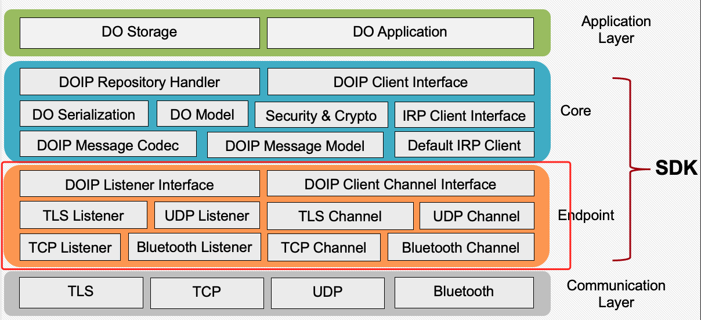

# DOIP的消息通讯

DOIP协议并不特定于某一个通讯协议，目前的SDK实现中DOIP协议基于Netty实现了TCP、TLS、UDP的消息通讯。

## DoipServer和DOIPListener

DoipServer通过设置DOIPListener的URL来基于不同的传输协议提供服务。

```java
public class DoipListenerInfo {
    public String url;
    public String protocolVersion;
    public String messageFormat;

    public DoipListenerInfo(String url, String protocolVersion, DoipMessageFormat messageFormat) {
        this.url = url;
        this.protocolVersion = protocolVersion;
        this.messageFormat = messageFormat.getName();
    }
}
```

DoipListenerGenerator会根据URL实例化相应的DoipListener监听。

```java
public class DoipListenerGenerater {

    static Logger logger = Logger.getLogger(NettyDoipListener.class);
    static HashMap<String,DoipListener> adhocListeners = new HashMap<>();

    public static DoipListener CreateDoipListener(DoipListenerInfo listenerInfo) {
        try {
            URI uri = new URI(listenerInfo.url);
            logger.debug("[URI Parse]scheme:" + uri.getScheme() + "host: " + uri.getHost() + "  port: " + uri.getPort());
            switch (uri.getScheme()) {
                case "tcp":
                case "TCP":
                case "udp":
                case "UDP":
                case "tls":
                case "TLS":
                    return NettyDoipListener.CreateDoipListener(listenerInfo);
                default:
                    if(adhocListeners.get(uri.getScheme())!= null )return adhocListeners.get(uri.getScheme());
                    logger.error("[Create repository error] Unsupported Listener: " + new Gson().toJson(listenerInfo));
                    return null;
            }
        } catch (Exception e) {
            e.printStackTrace();
            return null;
        }
    }

    public static void addListener(String schema, DoipListener listener){
        adhocListeners.put(schema,listener);
    }
}
```

DoipServer.start()接口会调用每个DoipListener.start()启动响应监听。

```java
@Override
public void start(){
    logger.info("DOIPServiceInfo: " + serviceInfo.toJson());
    for(DoipListener listener:listeners){
        listener.setRepositoryHandler(handler);
        ListenerContainer container = new ListenerContainer(listener);
        containers.add(container);
        container.start();
    }
}
```


## DoipClient和DoipClientChannel

DoipClient通过DoipClientChannel和DoipServer进行连接，通过不同的DoipClientChannel接口实现，DoipClient可以基于不同的传输协议发送DOIP请求，DoipClientChannel如下。

```java
public interface DoipClientChannel {
    void sendMessage(DoipMessage request, DoipMessageCallback callback);
    void close();
    void connect(String url) throws URISyntaxException;
    boolean isConnected();
}
```

DoipClient根据目标Server的url，通过DoipClientChannelGenerator.createDoipClientChannel()选择不同的DoipClientChannel实例创建连接：

```java
public class DoipClientChannelGenerator {
    static Logger logger = Logger.getLogger(NettyDoipListener.class);
    static HashMap<String, DoipClientChannel> adhocClient = new HashMap<>();

    public static DoipClientChannel createDoipClientChannel(String url) {
        try {
            URI uri = new URI(url);
            logger.debug("[URI Parse]scheme:" + uri.getScheme() + "host: " + uri.getHost() + "  port: " + uri.getPort());
            switch (uri.getScheme()) {
                case "tcp":
                case "TCP":
                case "udp":
                case "UDP":
                case "tls":
                case "TLS":
                    return NettyDoipClientChannel.createByRepoUrl(url);
                default:
                    if(adhocClient.get(uri.getScheme())!= null){
                        return adhocClient.get(uri.getScheme());
                    }
                    logger.error("[Create repository error] Unsupported URL: " + url);
                    return null;
            }
        } catch (Exception e) {
            e.printStackTrace();
            return null;
        }
    }

    public static void addClient(String schema, DoipClientChannel channel){
        adhocClient.put(schema,channel);
    }
}
```

同样，可以通过DoipClientChannelGenerator.addClient方法增加面向不同Schema的Channel，以扩展通讯协议。

# 扩展DOIP通讯协议

DOIP协议也支持基于任何已有的通讯协议的扩展，使得Repository和Client基于不同的协议进行通讯。实现DoipListener接口，并通过DoipListenerGenerator.addListener()将实现的DoipListener实例以及对应的Schema加入其中。

```java
public static void addListener(String schema, DoipListener listener){
    adhocListeners.put(schema,listener);
}
```

## DOIP代码结构



上图展示了DOIP SDK整体的代码结构，其中DOIPListener接口以及DOIPClientChannel则分别代表了对底层通讯协议的抽象。

## 基于经典蓝牙协议的DOIP扩展

下面以对经典蓝牙传输协议的扩展为例解释如何Add-Hoc的形式支持更多的传输协议。新增通讯协议的支持需要分别在Server端和Client端实现BluetoothDoipListener以及BluetoothDoipClientChannel。

### DoipListener

DoipListener接口包含三个方法：setRequestHandler，start以及stop。

其中setRepositoryHandler将实现了DoipRequestHandler的实例传入DoipListener，以处理DoipListener接收到的DoipMessage，并返回响应结果。

```java
public interface DoipListener {
    void start();
    void stop();
    void setRequestHandler(DoipRequestHandler handler);
}
```


SDK不对DoipListener的实现细节做任何规定，但理论上DoipListener需要实现的基本逻辑如下：

1. 启动对目标地址的监听，监听Client发送的Byte类型信息。
2. 收到输入的Byte，使用DoipMessageCodec提供的方法将字节数据解码为DoipMessage类型的请求。
3. 调用DoipRequestHandler处理请求，获取处理结果（同样为DoipMessage类型）。
4. 使用DoipMessageCodec提供的方法将处理结果编码为字节数据。
5. 将字节数据返回给相应从Client。

#### BluetoothDoipListener

经典蓝牙以Socket的形式抽象客户端和服务端之间的通信，BluetoothDoipListener基于Android的蓝牙API实现了基于经典蓝牙协议的DOIP消息传递。有关Android蓝牙API的介绍，请参阅相关文档，本文档仅展示和DOIP逻辑相关的关键代码。

BluetoothDoipListener对接口的实现：

```java
		public BlueToothDoipListener(Context c) {
      	codec = new PacketMessageCodecImpl();
        ctx = c;
    }

    @Override
    public void start() {
        log("start listener");
        try {
            listen(); //启动监听，等待客户端连接。本机地址为Mac地址。
        }catch (Exception e){
            e.printStackTrace();
        }
    }

    @Override
    public void stop() {
        try {
            mSSocket.close();  //关闭socket
            isListenning = false;
        } catch (IOException e) {
            e.printStackTrace();
        }
    }

    @Override
    public void setRequestHandler(DoipRequestHandler doipRequestHandler) {
        this.doipRequestHandler = doipRequestHandler; //初始化消息Handler
    }
```

建立连接后，从InputStream中读取并解码DoipMessage：

```java
//get doip message from input stream
private DoipMessage getDoipMessage(InputStream in){
    DoipMessage message = null;
    try {
        byte[] envHeader = getBytesFromInputStream(in,24);
        int requestId = ((envHeader[8+3] & 0xFF)
                | ((envHeader[8+2] & 0xFF)<<8)
                | ((envHeader[8+1] & 0xFF)<<16)
                | ((envHeader[8] & 0xFF)<<24));
        log("requestId: " + requestId);
        int contentLength = (int) ((envHeader[20+3] & 0xFF)
                | ((envHeader[20+2] & 0xFF)<<8)
                | ((envHeader[20+1] & 0xFF)<<16)
                | ((envHeader[20] & 0xFF)<<24));
        log("content Length: " + contentLength);

        byte[] envContent = getBytesFromInputStream(in, contentLength);
        return codec.BytesToMessage(envContent,requestId,null);
    } catch (Exception e) {
        e.printStackTrace();
    }
    return message;
}

//等待并从InputStream中读取指定长度的Bytes
private byte[] getBytesFromInputStream(InputStream in, int len) throws IOException {
    log("reading inputStream, available: " + in.available());
    int count = 0;
    while(in.available() < len && count <100){
      count ++;
      try {
        Thread.sleep(10);
      } catch (InterruptedException e) {
        e.printStackTrace();
      }
    }
    byte[] bytes = new byte[len];
    in.read(bytes);
    return bytes;
}
```

使用DoipRequestHandler处理请求，编码响应结果并使用OutputStream发送编码后的Bytes

```java
private void handleAndResponseDoipMessage(DoipMessage msg, OutputStream output){
    if (msg.header.parameters == null || msg.header.parameters.operation == null || msg.header.parameters.response != null) {
        replyStringWithStatus(output,msg,"invalid request", DoipResponseCode.Invalid);
        return;
    };
    if(msg.header.isCertified()){
        try {
            if(!GlobalCertifications.verifyDoipMessage(msg)){
                log("verification failed");
                return;
            }
        }catch (Exception e){
            e.printStackTrace();
            return;
        }
    }
    if (msg.credential != null) log("[Caller] client ID: " + msg.credential.getSigner());
    else log("[Caller] client ID: Anonymous");

    DoipMessage response = doipRequestCallback.onRequest(msg);

    if(response != null)
        sendResponse(output, response);
    else
        defaultHandler(output,msg);
}
//编码并返回响应
private void sendResponse(OutputStream output, DoipMessage response){
    try {
      if(response.header.isCertified()){
        try {
          GlobalCertifications.signDoipMessage(response);
        }catch (Exception e){
          e.printStackTrace();
        }
      }
      ArrayList<MessageEnvelope> envs = codec.MessageToEnvelopes(response);
      for(MessageEnvelope env:envs) {
        byte[] envBytes = codec.EnvelopeToBytes(env);
        log("sending bytes length: " + envBytes.length);
        output.write(codec.EnvelopeToBytes(env));
      }
    }catch (Exception e){
      e.printStackTrace();
    }
}
```

在实现BluetoothDoipListener之后，可以通过DoipListenerGeneraor.addListener()方法加入Listener库中。

```java
DoipListenerGenerater.addListener("bluetooth", new BlueToothDoipListener(ctx));
```

DoipServer在启动时会读取DoipServiceInfo中Listener的配置并根据url信息，选择相应的DoipListener实例启动。以下为示例蓝牙DoipServiceInfo配置：

```java
public static String listeners = "[{\"url\":\"bluetooth://1C:56:FE:CA:A6:0E\",\"protocolVersion\":\"2.1\",\"messageFormat\":\"packet\"}]";
public static String repoID = "86.5000.470/doip.localAndroidRepo";
public static String serviceDescription = "localAndroidRepo";
public static String serviceName = "localAndroidRepo";
public static String type = "repository";
```


### DoipClientChannel

DoipClientChannel是对客户端与Repository连接的抽象，通过DoipClientChannel接口的不同实现来支持底层不同的传输协议。DoipClientChannel接口如下：

```java
public interface DoipClientChannel {
    void sendMessage(DoipMessage request, DoipMessageCallback callback);
    void close();
    void connect(String url) throws URISyntaxException;  
    boolean isConnected();
}
```

DoipClientChannel的基本逻辑如下：

1. connect方法根据url建立和目标服务器的连接关系。
2. sendMessage方法使用DoipMessageCodec将DoipMessage类型的请求编码为字节数据。
3. 将字节数据发送给目标服务器，等待服务器返回。
4. 收到返回结果后调用回调函数

### BluetoothDoipClientChannel

下面以蓝牙为例，介绍如何实现基于蓝牙的DOIP Channel。如前文所述，socket是对经典蓝牙通讯的抽象，建立连接后通过socket的InputStream和OutputStream读取和写入字节数据，连接建立过程如下所示：

```java
@Override
public void connect(String url) throws URISyntaxException{
    isConnected = false;
    URI uri = new URI(url);
    this.address = uri.getAuthority();
    try {
        connectBTServer();
    } catch (IOException e) {
        e.printStackTrace();
    }
}

private void connectBTServer() throws IOException {
  bluetoothAdapter = BluetoothAdapter.getDefaultAdapter();
  if (bluetoothAdapter == null) {
    // 说明此设备不支持蓝牙操作
    log("do not support Bluetooth");
    return;
  }
  if (!bluetoothAdapter.isEnabled()) {
    AlertDialog dialog = new AlertDialog.Builder(ctx).setTitle("提示").setMessage("打开蓝牙再尝试!").create();
    dialog.show();
    return;
  }
  for(BluetoothDevice dev:bluetoothAdapter.getBondedDevices()){
    log("bounded bt address: " + dev.getAddress());
    log("bounded bt name: " + dev.getName());
    log("bounded bt state: " + dev.getType());
  };

  device = bluetoothAdapter.getRemoteDevice(address);
  if(device == null){
    log("cannot find target device. ");
    return;
  }
  log("remote bt address: " + device.getAddress());
  log("remote bt name: " + device.getName());
  log("remote bt state: " + device.getType());

  targetSocket = device.createRfcommSocketToServiceRecord(AndroidInitializer.DOIP_SERVICE_UUID);
	//启动新线程建立连接
  new ConnectThread(targetSocket).start();
}

class ConnectThread extends Thread{
    private BluetoothSocket mSocket;
    ConnectThread(BluetoothSocket s) throws IOException {
      mSocket = s;
    }
    @Override
    public synchronized void run(){
      // 关闭发现设备
      bluetoothAdapter.cancelDiscovery();
      if(mSocket.isConnected()) return;
      try{
        log("try to connect device");
        connecting = true;
        mSocket.connect();
        log("connected: " + mSocket.isConnected());
        log("remote device name: " + mSocket.getRemoteDevice().getName());
        log("remote device address: " + mSocket.getRemoteDevice().getAddress());
        isConnected = true;
      }catch(IOException connectException){
        connectException.printStackTrace();
      }finally {
        connecting = false;
    }
  }
}
```

通过targetSocket的OutputStream发送消息并启动线程监听InputStream等待返回：

```java
@Override
public void sendMessage(DoipMessage message, DoipMessageCallback cb){

    log("try to send message");
    if(device == null){
        Log.e(TAG,"no connection to target repository device");
    }
    try {
        while(!isConnected){
            log("not connected, wait for connect.");
            Thread.sleep(500);
        }

        if(message.requestID == 0) message.requestID = random.nextInt();
        log("requestID in message: " + message.requestID);

        OutputStream output = targetSocket.getOutputStream();
        ArrayList<MessageEnvelope> envelopes = codec.MessageToEnvelopes(message);

        waitingCallback.put(message.requestID,cb);

        log("connected: " + targetSocket.isConnected());
        for (MessageEnvelope env : envelopes) {
            log("requestID in envelope: " + env.requestId);
            byte[] envBytes = codec.EnvelopeToBytes(env);
            log("sending bytes length: " + envBytes.length);
            output.write(codec.EnvelopeToBytes(env));
        }
        InputStream input = targetSocket.getInputStream();
        new ResponseHandlerThread(input).start(); //启动线程等待返回

    }catch (Exception e){
        e.printStackTrace();
        targetSocket = null;
    }
};
```